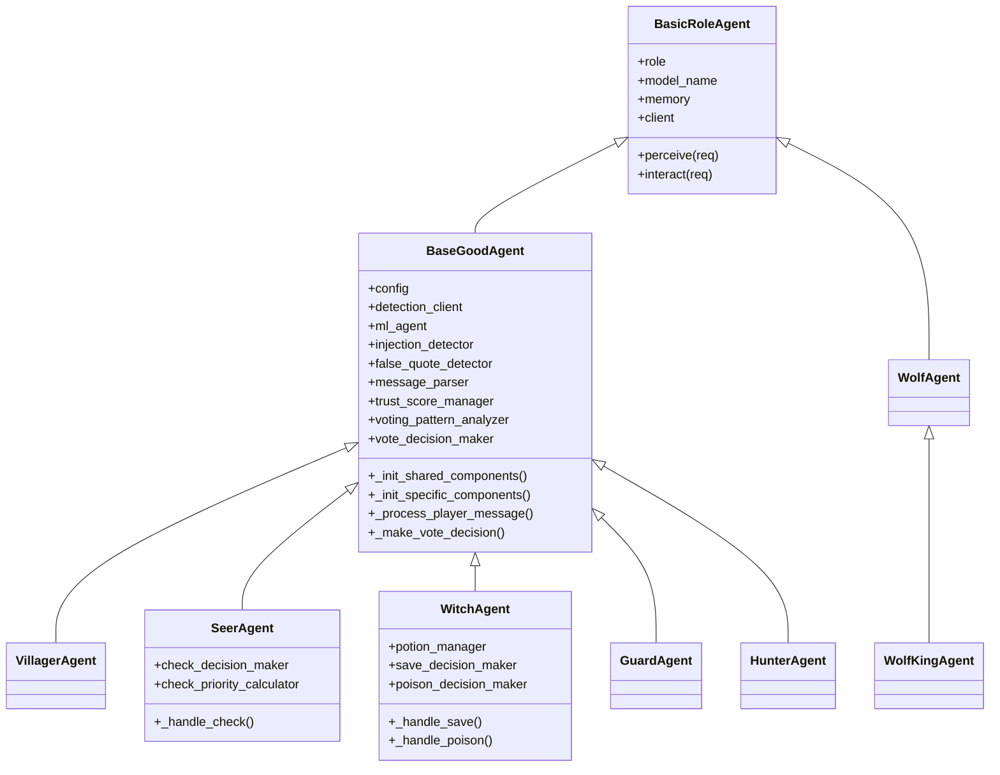

# 角色代理继承重构 - 设计文档

## 概述

本设计文档描述了如何通过继承机制重构狼人杀游戏中的角色代理，以减少代码重复、提高可维护性和可扩展性。重构将创建 `BaseGoodAgent` 基类来统一管理好人阵营角色的共享功能，同时保持每个角色的特有能力。

### 设计目标

1. **代码复用**: 将60-70%的重复代码提取到基类
2. **功能完整**: 保持所有角色100%功能不变
3. **向后兼容**: API接口和配置格式保持不变
4. **性能稳定**: 重构后性能变化在±5%以内
5. **易于扩展**: 新增角色只需继承基类并实现特有功能

### 设计原则

- **单一职责原则**: 每个类只负责一种角色的功能
- **开闭原则**: 对扩展开放，对修改关闭
- **里氏替换原则**: 子类可以完全替换父类
- **依赖倒置原则**: 依赖抽象接口而非具体实现
- **模板方法模式**: 基类定义算法骨架，子类实现具体步骤

## 架构设计

### 继承层次结构

```
BasicRoleAgent (SDK基类)
    │
    ├── BaseGoodAgent (好人基类 - 新增)
    │   ├── VillagerAgent (平民 - 重构)
    │   ├── SeerAgent (预言家 - 重构)
    │   ├── WitchAgent (女巫 - 重构)
    │   ├── GuardAgent (守卫 - 重构)
    │   └── HunterAgent (猎人 - 重构)
    │
    └── WolfAgent (狼人基类 - 保持不变)
        └── WolfKingAgent (狼王 - 已实现)
```

### 架构图



    class GuardAgent {
        +protect_decision_maker
        +protect_history
        +_handle_protect()
    }
    
    class HunterAgent {
        +shoot_decision_maker
        +threat_analyzer
        +can_shoot
        +_handle_shoot()
    }
```

## 组件和接口

### BaseGoodAgent 基类设计

`BaseGoodAgent` 是所有好人阵营角色的基类，提供共享功能和统一的组件管理机制。

#### 核心属性

```python
class BaseGoodAgent(BasicRoleAgent):
    """好人阵营基类"""
    
    # 配置
    config: BaseGoodConfig
    
    # 双模型架构
    detection_client: Optional[OpenAI]  # 检测专用LLM客户端
    detection_model: Optional[str]      # 检测模型名称
    
    # ML增强
    ml_agent: Optional[LightweightMLAgent]
    ml_enabled: bool
    
    # 检测器组件
    injection_detector: InjectionDetector
    false_quote_detector: FalseQuoteDetector
    message_parser: MessageParser
    speech_quality_evaluator: SpeechQualityEvaluator
    
    # 分析器组件
    trust_score_manager: TrustScoreManager
    trust_score_calculator: TrustScoreCalculator
    voting_pattern_analyzer: VotingPatternAnalyzer
    game_phase_analyzer: GamePhaseAnalyzer
    
    # 决策器组件
    vote_decision_maker: VoteDecisionMaker
    sheriff_election_decision_maker: SheriffElectionDecisionMaker
    sheriff_vote_decision_maker: SheriffVoteDecisionMaker
```

#### 核心方法

```python
def __init__(self, role: str, model_name: str):
    """初始化基类"""
    super().__init__(role, model_name=model_name)
    self._init_memory_variables()
    self.detection_client = self._init_detection_client()
    self._init_ml_enhancement()
    self._init_shared_components()
    self._init_specific_components()  # 钩子方法，由子类实现

def _init_memory_variables(self):
    """初始化内存变量（可被子类覆盖扩展）"""
    self.memory.set_variable("player_data", {})
    self.memory.set_variable("game_state", {})
    self.memory.set_variable("trust_scores", {})
    self.memory.set_variable("voting_results", {})
    # 子类可以添加更多变量

def _init_detection_client(self) -> Optional[OpenAI]:
    """初始化检测专用LLM客户端"""
    # 从环境变量读取DETECTION_MODEL_NAME
    # 创建独立的检测客户端
    pass

def _init_ml_enhancement(self):
    """初始化ML增强系统"""
    # 初始化LightweightMLAgent
    # 配置增量学习系统
    pass

def _init_shared_components(self):
    """初始化共享组件"""
    # 初始化检测器
    self.injection_detector = InjectionDetector(...)
    self.false_quote_detector = FalseQuoteDetector(...)
    # 初始化分析器
    self.trust_score_manager = TrustScoreManager(...)
    # 初始化决策器
    self.vote_decision_maker = VoteDecisionMaker(...)
```

def _init_specific_components(self):
    """初始化角色特有组件（钩子方法，由子类实现）"""
    pass

def _process_player_message(self, message: str, player_name: str):
    """处理玩家消息（共享逻辑）"""
    # 注入检测
    injection_type = self.injection_detector.detect(message, player_name)
    # 虚假引用检测
    is_false_quote = self.false_quote_detector.detect(...)
    # 消息解析
    parsed_info = self.message_parser.detect(message, player_name)
    # 更新信任分数
    self.trust_score_manager.update(...)

def _make_vote_decision(self, candidates: List[str]) -> str:
    """投票决策（共享逻辑）"""
    context = self._build_context()
    return self.vote_decision_maker.decide(candidates, context)

def _build_context(self) -> Dict:
    """构建决策上下文"""
    return {
        "player_data": self.memory.load_variable("player_data"),
        "game_state": self.memory.load_variable("game_state"),
        "trust_scores": self.memory.load_variable("trust_scores"),
        "my_name": self.memory.load_variable("name"),
    }

def _truncate_output(self, text: str, max_length: int) -> str:
    """截断输出文本"""
    # 共享的文本截断逻辑
    pass

def _validate_player_name(self, output: str, valid_choices: List[str]) -> str:
    """验证玩家名称"""
    # 共享的名称验证逻辑
    pass
```

### 子类设计

#### SeerAgent (预言家)

```python
class SeerAgent(BaseGoodAgent):
    """预言家代理"""
    
    def __init__(self, model_name: str):
        super().__init__(ROLE_SEER, model_name)
    
    def _init_memory_variables(self):
        """扩展内存变量"""
        super()._init_memory_variables()
        self.memory.set_variable("checked_players", {})
        self.memory.set_variable("night_count", 0)
    
    def _init_specific_components(self):
        """初始化预言家特有组件"""
        self.check_decision_maker = CheckDecisionMaker(self.config)
        self.check_priority_calculator = CheckPriorityCalculator(self.config)
        self.wolf_prob_estimator = WolfProbabilityEstimator(self.config)
    
    def _handle_check(self, req: AgentReq) -> AgentResp:
        """处理验人技能"""
        candidates = req.choices
        context = self._build_context()
        target = self.check_decision_maker.decide(candidates, context)
        return AgentResp(success=True, result=target)
    
    def _handle_skill_result(self, req: AgentReq):
        """处理验人结果"""
        target_player = req.name
        is_wolf = 'wolf' in req.message.lower()
        self.memory.load_variable("checked_players")[target_player] = is_wolf
        # 更新信任分数
        if is_wolf:
            self.trust_score_manager.update(target_player, -50, ...)
        else:
            self.trust_score_manager.update(target_player, +50, ...)
```

#### WitchAgent (女巫)

```python
class WitchAgent(BaseGoodAgent):
    """女巫代理"""
    
    def __init__(self, model_name: str):
        super().__init__(ROLE_WITCH, model_name)
    
    def _init_memory_variables(self):
        """扩展内存变量"""
        super()._init_memory_variables()
        self.memory.set_variable("has_antidote", True)
        self.memory.set_variable("has_poison", True)
        self.memory.set_variable("saved_players", [])
        self.memory.set_variable("poisoned_players", [])
    
    def _init_specific_components(self):
        """初始化女巫特有组件"""
        self.potion_manager = PotionManager(self.config)
        self.save_decision_maker = SaveDecisionMaker(self.config)
        self.poison_decision_maker = PoisonDecisionMaker(self.config)
    
    def _handle_save(self, killed_player: str) -> bool:
        """处理救人决策"""
        if not self.memory.load_variable("has_antidote"):
            return False
        context = self._build_context()
        context["killed_player"] = killed_player
        should_save = self.save_decision_maker.decide(context)
        if should_save:
            self.memory.set_variable("has_antidote", False)
        return should_save
    
    def _handle_poison(self, candidates: List[str]) -> Optional[str]:
        """处理毒人决策"""
        if not self.memory.load_variable("has_poison"):
            return None
        context = self._build_context()
        target = self.poison_decision_maker.decide(candidates, context)
        if target:
            self.memory.set_variable("has_poison", False)
        return target
```

#### GuardAgent (守卫)

```python
class GuardAgent(BaseGoodAgent):
    """守卫代理"""
    
    def __init__(self, model_name: str):
        super().__init__(ROLE_GUARD, model_name)
    
    def _init_memory_variables(self):
        """扩展内存变量"""
        super()._init_memory_variables()
        self.memory.set_variable("protect_history", [])
        self.memory.set_variable("last_protected", None)
    
    def _init_specific_components(self):
        """初始化守卫特有组件"""
        self.protect_decision_maker = ProtectDecisionMaker(self.config)
        self.protect_validator = ProtectValidator(self.config)
    
    def _handle_protect(self, candidates: List[str]) -> str:
        """处理守护决策"""
        context = self._build_context()
        target = self.protect_decision_maker.decide(candidates, context)
        
        # 验证守护目标（不能连续守护同一人）
        last_protected = self.memory.load_variable("last_protected")
        if target == last_protected:
            # 选择备选目标
            target = self._select_alternative_protect_target(candidates, target)
        
        self.memory.set_variable("last_protected", target)
        protect_history = self.memory.load_variable("protect_history")
        protect_history.append(target)
        self.memory.set_variable("protect_history", protect_history)
        
        return target
    
    def _select_alternative_protect_target(self, candidates: List[str], 
                                          excluded: str) -> str:
        """选择备选守护目标"""
        valid_candidates = [c for c in candidates if c != excluded]
        if not valid_candidates:
            return candidates[0]  # 如果没有其他选择，返回第一个
        context = self._build_context()
        return self.protect_decision_maker.decide(valid_candidates, context)
```

#### HunterAgent (猎人)

```python
class HunterAgent(BaseGoodAgent):
    """猎人代理"""
    
    def __init__(self, model_name: str):
        super().__init__(ROLE_HUNTER, model_name)
    
    def _init_memory_variables(self):
        """扩展内存变量"""
        super()._init_memory_variables()
        self.memory.set_variable("can_shoot", True)
        self.memory.set_variable("death_cause", None)
    
    def _init_specific_components(self):
        """初始化猎人特有组件"""
        self.shoot_decision_maker = ShootDecisionMaker(self.config)
        self.threat_analyzer = ThreatAnalyzer(self.config)
        self.wolf_prob_calculator = WolfProbCalculator(self.config)
    
    def _handle_shoot(self, candidates: List[str]) -> Optional[str]:
        """处理开枪决策"""
        if not self.memory.load_variable("can_shoot"):
            return None
        
        # 检查死亡原因（被毒死不能开枪）
        death_cause = self.memory.load_variable("death_cause")
        if death_cause == "poisoned":
            logger.info("Hunter was poisoned, cannot shoot")
            return None
        
        context = self._build_context()
        target = self.shoot_decision_maker.decide(candidates, context)
        
        if target:
            self.memory.set_variable("can_shoot", False)
        
        return target
    
    def _update_death_cause(self, message: str):
        """更新死亡原因"""
        if "poison" in message.lower():
            self.memory.set_variable("death_cause", "poisoned")
        elif "vote" in message.lower():
            self.memory.set_variable("death_cause", "voted")
        else:
            self.memory.set_variable("death_cause", "killed")
```

#### VillagerAgent (平民)

```python
class VillagerAgent(BaseGoodAgent):
    """平民代理"""
    
    def __init__(self, model_name: str):
        super().__init__(ROLE_VILLAGER, model_name)
    
    def _init_specific_components(self):
        """平民没有特有组件"""
        pass
```

平民可以直接使用基类的所有功能，不需要添加特有组件。这是继承设计的优势之一。

## 数据模型

### 配置模型

#### BaseGoodConfig

```python
@dataclass
class BaseGoodConfig:
    """好人基类配置"""
    
    # 检测器配置
    INJECTION_DETECTION_ENABLED: bool = True
    FALSE_QUOTE_DETECTION_ENABLED: bool = True
    MESSAGE_PARSING_ENABLED: bool = True
    
    # 信任分数配置
    TRUST_WOLF_CHECK: int = -50
    TRUST_GOOD_CHECK: int = 50
    TRUST_INJECTION_ATTACK: int = -30
    TRUST_FALSE_QUOTATION: int = -20
    TRUST_LOGICAL_SPEECH: int = 10
    TRUST_ACCURATE_VOTING: int = 15
    TRUST_INACCURATE_VOTING: int = -15
    
    # ML配置
    ML_ENABLED: bool = True
    ML_MODEL_DIR: str = "./ml_models"
    ML_RETRAIN_INTERVAL: int = 5
    
    # 发言配置
    MAX_SPEECH_LENGTH: int = 500
    
    # 决策配置
    VOTE_STRATEGY: str = "trust_based"  # trust_based, ml_based, hybrid
```

#### 角色特有配置

```python
@dataclass
class SeerConfig(BaseGoodConfig):
    """预言家配置"""
    CHECK_PRIORITY_STRATEGY: str = "high_suspicion"  # high_suspicion, random, strategic
    REVEAL_IDENTITY_THRESHOLD: int = 3  # 验证多少人后公开身份

@dataclass
class WitchConfig(BaseGoodConfig):
    """女巫配置"""
    SAVE_STRATEGY: str = "conservative"  # conservative, aggressive, strategic
    POISON_STRATEGY: str = "confirmed_wolf"  # confirmed_wolf, high_suspicion, strategic
    SAVE_SELF_ALLOWED: bool = True

@dataclass
class GuardConfig(BaseGoodConfig):
    """守卫配置"""
    PROTECT_STRATEGY: str = "high_value"  # high_value, random, strategic
    PROTECT_SELF_ALLOWED: bool = False

@dataclass
class HunterConfig(BaseGoodConfig):
    """猎人配置"""
    SHOOT_STRATEGY: str = "high_wolf_prob"  # high_wolf_prob, high_threat, strategic
    SHOOT_THRESHOLD: float = 0.6  # 狼人概率阈值
```

### 内存数据模型

#### 玩家数据结构

```python
PlayerData = {
    "name": str,
    "alive": bool,
    "claimed_role": Optional[str],
    "trust_score": float,
    "wolf_probability": float,
    "speech_quality": int,
    "vote_history": List[Dict],
    "malicious_injection": bool,
    "false_quotes": bool,
    "logical_speech": bool,
    "supported_by": List[str],
    "suspected_by": List[str],
}
```

#### 游戏状态结构

```python
GameState = {
    "current_day": int,
    "current_round": int,
    "wolves_dead": int,
    "goods_dead": int,
    "total_players": int,
    "alive_count": int,
    "sheriff": Optional[str],
    "sheriff_election": bool,
    "sheriff_candidates": List[str],
}
```

#### 角色特有数据

```python
# 预言家
SeerData = {
    "checked_players": Dict[str, bool],  # {player_name: is_wolf}
    "night_count": int,
}

# 女巫
WitchData = {
    "has_antidote": bool,
    "has_poison": bool,
    "saved_players": List[str],
    "poisoned_players": List[str],
}

# 守卫
GuardData = {
    "protect_history": List[str],
    "last_protected": Optional[str],
}

# 猎人
HunterData = {
    "can_shoot": bool,
    "death_cause": Optional[str],  # "poisoned", "voted", "killed"
}
```

## 正确性属性

*属性是一个特征或行为，应该在系统的所有有效执行中保持为真——本质上是关于系统应该做什么的形式化陈述。属性作为人类可读规范和机器可验证正确性保证之间的桥梁。*

### Property 1: BaseGoodAgent 类结构完整性

*For any* BaseGoodAgent instance, it should have all required shared components (injection_detector, false_quote_detector, message_parser, trust_score_manager, voting_pattern_analyzer, vote_decision_maker) initialized and accessible.

**Validates: Requirements 1.1, 3.1**

### Property 2: 共享方法可访问性

*For any* good role agent (Villager, Seer, Witch, Guard, Hunter), all shared methods from BaseGoodAgent (_process_player_message, _make_vote_decision, _truncate_output, _validate_player_name, _build_context) should be accessible and callable.

**Validates: Requirements 1.2**

### Property 3: 好人角色继承正确性

*For any* good role agent class (VillagerAgent, SeerAgent, WitchAgent, GuardAgent, HunterAgent), it should inherit from BaseGoodAgent and isinstance(agent, BaseGoodAgent) should return True.

**Validates: Requirements 1.3, 1.4, 1.5, 1.6**

### Property 4: 功能保持不变

*For any* role agent and any game scenario, the agent's behavior after refactoring should be identical to its behavior before refactoring, including all decision-making, message processing, and state management.

**Validates: Requirements 1.7, 4.2, 4.3, 4.4**

### Property 5: 组件初始化模式一致性

*For any* good role agent, after initialization, the following should be true:
- _init_shared_components() has been called and all shared components are initialized
- _init_specific_components() has been called (may be empty for Villager)
- All required memory variables are initialized
- ML enhancement is initialized if enabled
- Detection client is initialized if configured

**Validates: Requirements 3.1, 3.2, 3.3, 3.4, 3.5**

### Property 6: 狼人阵营继承结构

*For any* wolf-type agent (WolfAgent, WolfKingAgent), WolfKingAgent should inherit from WolfAgent, and all WolfAgent methods should be accessible from WolfKingAgent instances.

**Validates: Requirements 2.1, 2.2, 2.3, 2.4**

### Property 7: 测试套件兼容性

*For any* existing test case in the test suite, it should pass after the refactoring with the same results as before.

**Validates: Requirements 4.1**

### Property 8: 性能保持稳定

*For any* agent operation (initialization, message processing, decision making), the execution time after refactoring should not exceed 105% of the execution time before refactoring.

**Validates: Requirements 4.5**

### Property 9: 角色特有功能隔离性

*For any* role-specific method (e.g., SeerAgent._handle_check, WitchAgent._handle_save, GuardAgent._handle_protect, HunterAgent._handle_shoot), it should only exist in the specific role class and not in BaseGoodAgent or other role classes.

**Validates: Requirements 1.3, 1.4, 1.5, 1.6**

### Property 10: 配置继承正确性

*For any* role-specific config class (SeerConfig, WitchConfig, GuardConfig, HunterConfig), it should inherit from BaseGoodConfig and all base configuration values should be accessible.

**Validates: Requirements 3.1, 4.3**

## 错误处理

### 初始化错误处理

```python
def __init__(self, role: str, model_name: str):
    try:
        super().__init__(role, model_name=model_name)
        self._init_memory_variables()
        self.detection_client = self._init_detection_client()
        self._init_ml_enhancement()
        self._init_shared_components()
        self._init_specific_components()
    except Exception as e:
        logger.error(f"Failed to initialize {role} agent: {e}")
        raise AgentInitializationError(f"Initialization failed: {e}") from e
```

### 组件初始化错误处理

```python
def _init_shared_components(self):
    """初始化共享组件，带错误处理"""
    try:
        self.injection_detector = InjectionDetector(self.config, self.detection_client)
    except Exception as e:
        logger.warning(f"Failed to initialize injection detector: {e}")
        self.injection_detector = None
    
    try:
        self.false_quote_detector = FalseQuoteDetector(self.config, self.detection_client)
    except Exception as e:
        logger.warning(f"Failed to initialize false quote detector: {e}")
        self.false_quote_detector = None
    
    # 其他组件类似处理
    # 关键组件失败应该抛出异常，非关键组件可以降级
```

### ML增强错误处理

```python
def _init_ml_enhancement(self):
    """初始化ML增强，带降级处理"""
    try:
        if not ML_AGENT_AVAILABLE:
            logger.info("ML enhancement disabled - module not available")
            self.ml_enabled = False
            return
        
        model_dir = os.getenv('ML_MODEL_DIR', './ml_models')
        self.ml_agent = LightweightMLAgent(model_dir=model_dir)
        self.ml_enabled = self.ml_agent.enabled
        
        if self.ml_enabled:
            logger.info("✓ ML enhancement enabled")
        else:
            logger.info("⚠ ML enhancement initialized but not enabled")
    except Exception as e:
        logger.error(f"✗ Failed to initialize ML enhancement: {e}")
        self.ml_agent = None
        self.ml_enabled = False
        # 不抛出异常，允许降级运行
```

### 运行时错误处理

```python
def _process_player_message(self, message: str, player_name: str):
    """处理玩家消息，带错误处理"""
    try:
        # 注入检测
        if self.injection_detector:
            injection_type = self.injection_detector.detect(message, player_name)
            self._handle_injection_result(injection_type, player_name)
    except Exception as e:
        logger.error(f"Injection detection failed for {player_name}: {e}")
        # 继续处理，不中断
    
    try:
        # 虚假引用检测
        if self.false_quote_detector:
            is_false_quote = self.false_quote_detector.detect(...)
            self._handle_false_quote_result(is_false_quote, player_name)
    except Exception as e:
        logger.error(f"False quote detection failed for {player_name}: {e}")
        # 继续处理，不中断
    
    # 其他处理类似
```

### 决策错误处理

```python
def _make_vote_decision(self, candidates: List[str]) -> str:
    """投票决策，带回退机制"""
    try:
        context = self._build_context()
        return self.vote_decision_maker.decide(candidates, context)
    except Exception as e:
        logger.error(f"Vote decision failed: {e}, using fallback")
        # 回退到简单策略：选择信任分数最低的
        return self._fallback_vote_decision(candidates)

def _fallback_vote_decision(self, candidates: List[str]) -> str:
    """回退投票决策"""
    trust_scores = self.memory.load_variable("trust_scores")
    if not trust_scores:
        return candidates[0] if candidates else ""
    
    min_trust = float('inf')
    target = candidates[0] if candidates else ""
    for candidate in candidates:
        trust = trust_scores.get(candidate, 50)
        if trust < min_trust:
            min_trust = trust
            target = candidate
    return target
```

## 测试策略

### 双重测试方法

本项目采用单元测试和属性测试相结合的方法：

- **单元测试**: 验证特定示例、边缘情况和错误条件
- **属性测试**: 通过随机化验证所有输入的通用属性
- 两者互补，对于全面覆盖都是必要的

### 单元测试策略

单元测试应该专注于：
- 特定示例，展示正确行为
- 组件之间的集成点
- 边缘情况和错误条件

避免编写过多单元测试 - 基于属性的测试处理大量输入的覆盖。

#### 单元测试示例

```python
def test_base_good_agent_initialization():
    """测试BaseGoodAgent初始化"""
    agent = BaseGoodAgent(ROLE_VILLAGER, "gpt-4")
    
    # 验证共享组件已初始化
    assert agent.injection_detector is not None
    assert agent.false_quote_detector is not None
    assert agent.trust_score_manager is not None
    assert agent.vote_decision_maker is not None
    
    # 验证内存变量已初始化
    assert agent.memory.load_variable("player_data") == {}
    assert agent.memory.load_variable("game_state") == {}

def test_seer_inherits_from_base_good_agent():
    """测试预言家继承BaseGoodAgent"""
    seer = SeerAgent("gpt-4")
    
    assert isinstance(seer, BaseGoodAgent)
    assert isinstance(seer, BasicRoleAgent)
    assert seer.role == ROLE_SEER
    
    # 验证可以访问基类方法
    assert hasattr(seer, '_process_player_message')
    assert hasattr(seer, '_make_vote_decision')
    
    # 验证有特有组件
    assert hasattr(seer, 'check_decision_maker')
    assert hasattr(seer, 'check_priority_calculator')
```

def test_witch_potion_management():
    """测试女巫药水管理"""
    witch = WitchAgent("gpt-4")
    
    # 初始状态
    assert witch.memory.load_variable("has_antidote") == True
    assert witch.memory.load_variable("has_poison") == True
    
    # 使用解药
    witch._handle_save("No.1")
    assert witch.memory.load_variable("has_antidote") == False
    
    # 使用毒药
    witch._handle_poison(["No.2", "No.3"])
    assert witch.memory.load_variable("has_poison") == False

def test_guard_cannot_protect_same_player_twice():
    """测试守卫不能连续守护同一人"""
    guard = GuardAgent("gpt-4")
    
    candidates = ["No.1", "No.2", "No.3"]
    
    # 第一次守护
    target1 = guard._handle_protect(candidates)
    assert target1 in candidates
    
    # 第二次守护应该选择不同的人
    target2 = guard._handle_protect(candidates)
    assert target2 in candidates
    assert target2 != target1

def test_hunter_cannot_shoot_when_poisoned():
    """测试猎人被毒死不能开枪"""
    hunter = HunterAgent("gpt-4")
    
    # 设置死亡原因为被毒
    hunter.memory.set_variable("death_cause", "poisoned")
    
    # 尝试开枪
    result = hunter._handle_shoot(["No.1", "No.2"])
    assert result is None
```

### 属性测试策略

属性测试配置：
- 每个属性测试最少100次迭代（由于随机化）
- 每个属性测试必须引用其设计文档属性
- 标签格式：**Feature: agent-inheritance-refactor, Property {number}: {property_text}**

#### 属性测试示例

```python
from hypothesis import given, strategies as st

@given(
    role=st.sampled_from([ROLE_VILLAGER, ROLE_SEER, ROLE_WITCH, ROLE_GUARD, ROLE_HUNTER])
)
def test_property_1_base_good_agent_structure(role):
    """
    Property 1: BaseGoodAgent 类结构完整性
    Feature: agent-inheritance-refactor, Property 1: BaseGoodAgent instance has all required shared components
    """
    agent_class = {
        ROLE_VILLAGER: VillagerAgent,
        ROLE_SEER: SeerAgent,
        ROLE_WITCH: WitchAgent,
        ROLE_GUARD: GuardAgent,
        ROLE_HUNTER: HunterAgent,
    }[role]
    
    agent = agent_class("gpt-4")
    
    # 验证所有共享组件已初始化
    assert hasattr(agent, 'injection_detector')
    assert hasattr(agent, 'false_quote_detector')
    assert hasattr(agent, 'message_parser')
    assert hasattr(agent, 'trust_score_manager')
    assert hasattr(agent, 'voting_pattern_analyzer')
    assert hasattr(agent, 'vote_decision_maker')
    
    assert agent.injection_detector is not None
    assert agent.false_quote_detector is not None
    assert agent.message_parser is not None
    assert agent.trust_score_manager is not None
    assert agent.voting_pattern_analyzer is not None
    assert agent.vote_decision_maker is not None
```

@given(
    role=st.sampled_from([ROLE_VILLAGER, ROLE_SEER, ROLE_WITCH, ROLE_GUARD, ROLE_HUNTER])
)
def test_property_2_shared_methods_accessibility(role):
    """
    Property 2: 共享方法可访问性
    Feature: agent-inheritance-refactor, Property 2: All shared methods are accessible
    """
    agent_class = {
        ROLE_VILLAGER: VillagerAgent,
        ROLE_SEER: SeerAgent,
        ROLE_WITCH: WitchAgent,
        ROLE_GUARD: GuardAgent,
        ROLE_HUNTER: HunterAgent,
    }[role]
    
    agent = agent_class("gpt-4")
    
    # 验证共享方法存在且可调用
    assert callable(getattr(agent, '_process_player_message', None))
    assert callable(getattr(agent, '_make_vote_decision', None))
    assert callable(getattr(agent, '_truncate_output', None))
    assert callable(getattr(agent, '_validate_player_name', None))
    assert callable(getattr(agent, '_build_context', None))

@given(
    role=st.sampled_from([ROLE_VILLAGER, ROLE_SEER, ROLE_WITCH, ROLE_GUARD, ROLE_HUNTER])
)
def test_property_3_good_role_inheritance(role):
    """
    Property 3: 好人角色继承正确性
    Feature: agent-inheritance-refactor, Property 3: All good roles inherit from BaseGoodAgent
    """
    agent_class = {
        ROLE_VILLAGER: VillagerAgent,
        ROLE_SEER: SeerAgent,
        ROLE_WITCH: WitchAgent,
        ROLE_GUARD: GuardAgent,
        ROLE_HUNTER: HunterAgent,
    }[role]
    
    agent = agent_class("gpt-4")
    
    # 验证继承关系
    assert isinstance(agent, BaseGoodAgent)
    assert isinstance(agent, BasicRoleAgent)
    assert agent.role == role
```

@given(
    role=st.sampled_from([ROLE_VILLAGER, ROLE_SEER, ROLE_WITCH, ROLE_GUARD, ROLE_HUNTER]),
    message=st.text(min_size=10, max_size=200),
    player_name=st.sampled_from(["No.1", "No.2", "No.3", "No.4"])
)
def test_property_5_component_initialization_consistency(role, message, player_name):
    """
    Property 5: 组件初始化模式一致性
    Feature: agent-inheritance-refactor, Property 5: Component initialization is consistent
    """
    agent_class = {
        ROLE_VILLAGER: VillagerAgent,
        ROLE_SEER: SeerAgent,
        ROLE_WITCH: WitchAgent,
        ROLE_GUARD: GuardAgent,
        ROLE_HUNTER: HunterAgent,
    }[role]
    
    agent = agent_class("gpt-4")
    
    # 验证共享组件已初始化
    assert agent.injection_detector is not None
    assert agent.trust_score_manager is not None
    assert agent.vote_decision_maker is not None
    
    # 验证内存变量已初始化
    assert agent.memory.load_variable("player_data") is not None
    assert agent.memory.load_variable("game_state") is not None
    assert agent.memory.load_variable("trust_scores") is not None
    
    # 验证可以处理消息（不抛出异常）
    try:
        agent._process_player_message(message, player_name)
    except Exception as e:
        # 某些消息可能导致预期的错误，但不应该是初始化问题
        assert "not initialized" not in str(e).lower()
        assert "NoneType" not in str(e)

@given(
    candidates=st.lists(
        st.sampled_from(["No.1", "No.2", "No.3", "No.4", "No.5"]),
        min_size=2,
        max_size=5,
        unique=True
    )
)
def test_property_8_performance_stability(candidates):
    """
    Property 8: 性能保持稳定
    Feature: agent-inheritance-refactor, Property 8: Performance does not degrade
    """
    import time
    
    agent = VillagerAgent("gpt-4")
    
    # 测试投票决策性能
    start_time = time.time()
    result = agent._make_vote_decision(candidates)
    elapsed_time = time.time() - start_time
    
    # 验证决策时间合理（应该在1秒内完成）
    assert elapsed_time < 1.0
    assert result in candidates or result == ""
```

### 集成测试策略

集成测试验证重构后的代理在完整游戏场景中的行为：

```python
def test_full_game_scenario_with_refactored_agents():
    """测试完整游戏场景"""
    # 创建所有角色
    villager = VillagerAgent("gpt-4")
    seer = SeerAgent("gpt-4")
    witch = WitchAgent("gpt-4")
    guard = GuardAgent("gpt-4")
    hunter = HunterAgent("gpt-4")
    
    # 模拟游戏流程
    # 1. 游戏开始
    # 2. 夜晚阶段
    # 3. 白天讨论
    # 4. 投票
    # 5. 验证所有角色正常工作
    
    # 验证游戏可以正常进行
    assert True  # 如果没有异常，测试通过

def test_backward_compatibility_with_existing_game_logic():
    """测试与现有游戏逻辑的向后兼容性"""
    # 使用重构后的代理运行现有的游戏测试
    # 验证结果与重构前一致
    pass
```

### 回归测试策略

回归测试确保重构不破坏现有功能：

1. **保留所有现有测试**: 不删除任何现有测试用例
2. **运行完整测试套件**: 重构后运行所有测试
3. **对比测试结果**: 确保通过率100%
4. **性能基准对比**: 确保性能变化在±5%以内

### 测试覆盖率目标

- 单元测试覆盖率: > 80%
- 属性测试覆盖率: 所有正确性属性
- 集成测试覆盖率: 所有主要游戏场景
- 回归测试覆盖率: 100%现有测试

## 实施计划

### 阶段1: 准备和分析 (1天)

1. **代码分析**
   - 详细分析现有5个好人角色的代码
   - 识别所有共享功能和特有功能
   - 创建功能对比矩阵

2. **设计验证**
   - 审查本设计文档
   - 与团队讨论设计方案
   - 确定最终的类结构和接口

3. **测试准备**
   - 为每个角色编写集成测试
   - 建立性能基准
   - 准备测试数据

### 阶段2: 创建基类 (1天)

1. **创建BaseGoodAgent**
   - 在 `werewolf/core/` 目录创建 `base_good_agent.py`
   - 实现所有共享功能
   - 实现钩子方法

2. **创建BaseGoodConfig**
   - 在 `werewolf/core/` 目录创建 `base_good_config.py`
   - 定义所有共享配置

3. **测试基类**
   - 编写基类单元测试
   - 验证所有共享功能正常工作

### 阶段3: 重构子类 (2天)

#### Day 1: 重构平民和预言家

1. **重构VillagerAgent**
   - 修改继承关系
   - 移除重复代码
   - 保留特有功能（如果有）
   - 运行测试验证

2. **重构SeerAgent**
   - 修改继承关系
   - 移除重复代码
   - 保留验人功能
   - 运行测试验证

#### Day 2: 重构女巫、守卫、猎人

3. **重构WitchAgent**
   - 修改继承关系
   - 移除重复代码
   - 保留药水功能
   - 运行测试验证

4. **重构GuardAgent**
   - 修改继承关系
   - 移除重复代码
   - 保留守护功能
   - 运行测试验证

5. **重构HunterAgent**
   - 修改继承关系
   - 移除重复代码
   - 保留开枪功能
   - 运行测试验证

### 阶段4: 测试和优化 (1天)

1. **集成测试**
   - 运行所有单元测试
   - 运行所有属性测试
   - 运行集成测试
   - 验证功能完整性

2. **性能测试**
   - 对比重构前后性能
   - 识别性能瓶颈
   - 优化关键路径

3. **代码审查**
   - 检查代码质量
   - 确保符合设计原则
   - 完善文档和注释

4. **最终验证**
   - 运行完整游戏测试
   - 验证所有角色正常工作
   - 确认向后兼容性

## 风险和缓解措施

### 风险1: 破坏现有功能

**概率**: 中  
**影响**: 高  
**缓解措施**:
- 采用渐进式重构，一次重构一个角色
- 每个角色重构后立即运行测试
- 保留原代码备份
- 使用版本控制，可以快速回滚

### 风险2: 性能下降

**概率**: 低  
**影响**: 中  
**缓解措施**:
- 建立性能基准
- 每次重构后进行性能测试
- 优化继承链深度（最多2层）
- 使用性能分析工具识别瓶颈

### 风险3: 增加复杂度

**概率**: 中  
**影响**: 中  
**缓解措施**:
- 保持继承层次简单
- 充分的代码注释和文档
- 提供使用示例
- 团队代码审查

### 风险4: 测试覆盖不足

**概率**: 低  
**影响**: 高  
**缓解措施**:
- 编写全面的单元测试
- 使用属性测试覆盖边界情况
- 运行集成测试验证整体功能
- 保持测试覆盖率 > 80%

## 成功指标

### 代码质量指标

- ✅ 代码重复率降低 > 50%
- ✅ 代码行数减少 > 30%
- ✅ 圈复杂度降低 > 20%
- ✅ 测试覆盖率保持 > 80%

### 功能完整性指标

- ✅ 所有现有测试用例通过率 = 100%
- ✅ 功能完整性 = 100%
- ✅ API兼容性 = 100%

### 性能指标

- ✅ 初始化时间变化 < ±5%
- ✅ 内存占用变化 < ±5%
- ✅ 响应时间变化 < ±5%

### 可维护性指标

- ✅ 新增角色开发时间减少 > 40%
- ✅ Bug修复时间减少 > 30%
- ✅ 代码审查时间减少 > 25%

## 文档和培训

### 技术文档

1. **架构文档**: 更新系统架构文档，说明新的继承结构
2. **API文档**: 更新API文档，说明BaseGoodAgent的接口
3. **开发指南**: 编写如何添加新角色的指南
4. **迁移指南**: 如果有外部依赖，提供迁移指南

### 代码注释

1. **类文档**: 每个类都有详细的文档字符串
2. **方法文档**: 每个方法都有参数和返回值说明
3. **设计决策**: 关键设计决策在代码中注释说明
4. **示例代码**: 提供使用示例

### 团队培训

1. **设计评审**: 与团队分享设计文档
2. **代码演示**: 演示新的继承结构和使用方法
3. **最佳实践**: 分享继承和组合的最佳实践
4. **Q&A会议**: 回答团队问题

## 总结

本设计文档描述了通过继承机制重构狼人杀游戏角色代理的完整方案。通过创建 `BaseGoodAgent` 基类，我们可以：

1. **减少60-70%的代码重复**
2. **提高代码可维护性和可扩展性**
3. **保持100%功能完整性和向后兼容性**
4. **为未来添加新角色提供清晰的模式**

重构将分4个阶段进行，总计5天时间。每个阶段都有明确的目标和验收标准。通过全面的测试策略（单元测试 + 属性测试 + 集成测试），我们可以确保重构的正确性和安全性。
